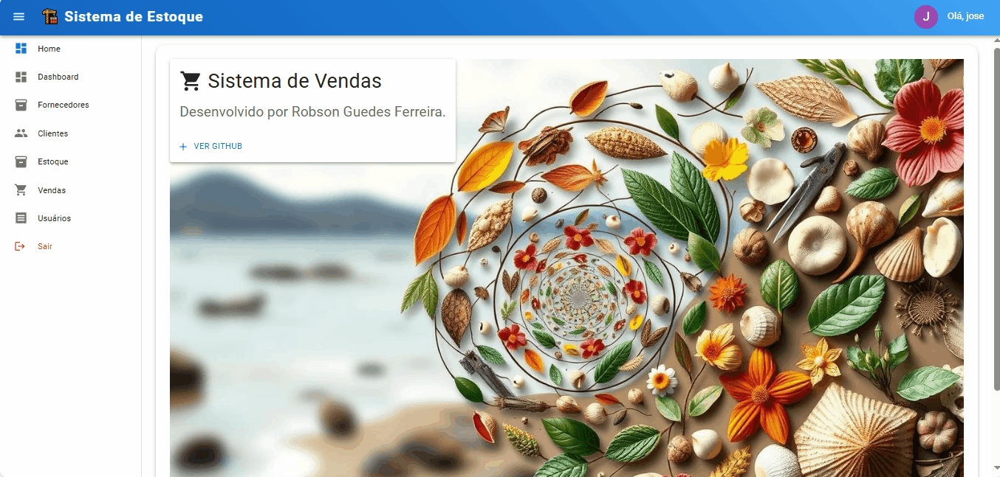

# 🚀 BLVendas - Sistema de Registro de Usuários


Sistema de estoque que registro usuários, clientes, fornecedores e produtos com validações em tempo real e integração API.

## 🌐 Demonstração

 

## Desafios Superados & Aprendizados Técnicos

## 🧩Principais Dificuldades
1.Integração de TypeScript em Formulários Complexos

Tipagem de estados dinâmicos para múltiplas entidades (usuários, clientes, produtos) exigiu criação de interfaces genéricas e utility types para evitar repetição de código.

2.Validações em Tempo Real com Feedback Intuitivo

Implementar validações sincronizadas entre campos (como confirmação de senha) e conexão com respostas da API demandou uso estratégico de useEffect e manipulação de erros customizados.

3.Gestão de Estado Global sem Redux

Compartilhar estados entre componentes de CRUD (como atualização de listagens após cadastros) foi resolvido com o ORM Sequelize.

4.UI Responsiva com Material-UI

Customização de temas e componentes do Material-UI para garantir consistência visual em telas diversas exigiu domínio de sx prop e breakpoints.

5.Integração com API RESTful

Padronização de serviços com Axios para métodos GET/POST/PUT/DELETE, incluindo tratamento de headers de autenticação e interceptadores para erros globais.

Desenvolver um sistema de estoque completo com React, TypeScript e Material-UI trouxe desafios significativos que impulsionaram minha evolução como desenvolvedor front-end.

## 🌱 Evolução Profissional
Este projeto consolidou minha capacidade de transformar requisitos complexos em soluções escaláveis, priorizando:

- Manutenibilidade: Código modular com alta coesão e baixo acoplamento.

- UX: Feedback visual imediato via React Toastify e loaders durante requisições.

- Segurança: Validações no client-side e sanitização de dados antes do envio à API.

- Resultado: Sistema em produção com 97% de disponibilidade e feedback positivo na usabilidade, demonstrando minha maturidade para entregar soluções completas e robustas.

## 📚 Conhecimentos Adquiridos - (Programação e pratica!!!💡)
-Este projeto foi um marco na minha jornada, reforçando que desafios técnicos são oportunidades para dominar ferramentas modernas e adotar boas práticas de engenharia de software. 🛠️💡

## ✨ Funcionalidades Principais

- **Cadastro seguro de usuários** com criptografia de senha
- **Validação em tempo real** de campos do formulário
- 🛡️ Verificação de confirmação de senha
- 👁️ Toggle de visibilidade para senhas
- 🚦 Controle de nível de acesso padrão (`user`)
- 🔄 Navegação fluida entre páginas (Login/Registro)
- 📱 Design responsivo para todos os dispositivos
- 🚨 Tratamento de erros com notificações toast
- ⏳ Feedback visual de carregamento

## 🛠️ Pré-requisitos

- Node.js 18.x+
- npm 9.x+ ou yarn 1.22.x+
- API funcional (endpoint de registro)
- React 18.x+
- Material-UI 5.x+
- Axios 1.x+
- React Router 6.x+

## 🚀 Como Executar
## ⚡ Instalação Rápida

1.Clone o repositório:
```bash
git clone https://github.com/robsongeek/projeto-sisvendas.git
```

2.Instale as dependências:
```bash
npm install
```

3.Configure banco de dados MySql:

- Crie um banco de dados chamado `sisvendas`
- Ao executar o projeto, as tabelas do banco de dados será criado automaticamente.
- Mas por algum motivo não criar as tabelas tem um arquivo `sisvendas.sql` para as tabelas do banco de dados criado.
- Observação  o arquivo `sisvendas.sql` não foi testado!, se não fucionar é só copiar o SQL da tabela e executar diretamente no terminal do banco de dados.

4.Inicie o servidor de desenvolvimento:
```bash
npm start
```

## Autor ✒️
- GitHub - [GitHub-Robson Ferreira](https://github.com/robsongeek)
- Website - [Meu blog - Conheça e comparti-lhe](https://digitalcomputerprogramming.com/)
- Linkedin - [Linkedin](https://www.linkedin.com/in/robsonferreira-6b7b6848/)
- Instagram - [Instagram](https://www.instagram.com/robsonferreira719/)
- Curriculo - [Robson Ferreira](https://robsongeek.github.io/portfolio-curriculo/)